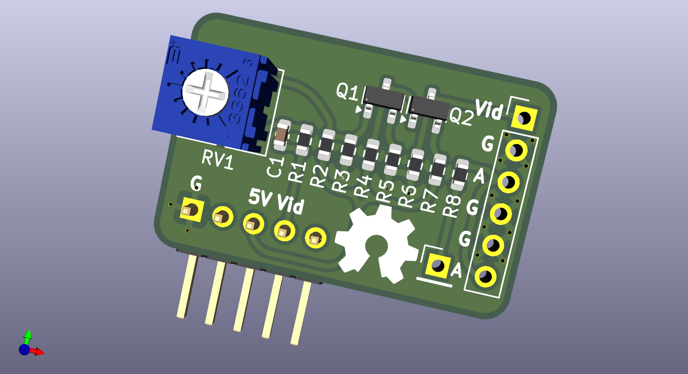

# Atari2600 Two Transistor Comp Mod
A PCB design for a two transistor based composit video out mod the the Atari 2600.

Gerber files have been generated and can be found in the [Gerbers folder](./Gerbers)